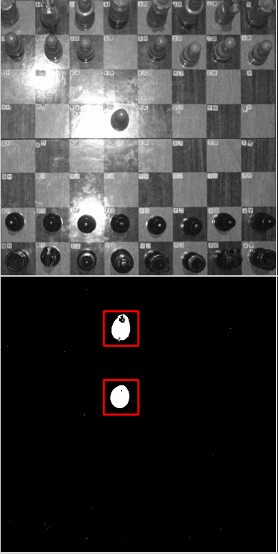

# EyesChess

A computer vision program capable of detecting moves on a chess board through a top-view camera.
It uses image subtraction, thresholding and homography techniques to achieve this.



As future improvements, the application should/could:

* Improve the UI to user desktop application standards.
* Use a chess engine to track the game state, play the game out and display a digital board.
* Allow playing against online opponents through a chess API (e.g. [Lichess](https://lichess.org/)).
* Capture video feed from a webcam, and not just video files.
* Go beyond top-view, begin able to adapt to angled camera views.
* Detect the location of the board instead of having the user select it manually.
* Prevent camera movement from breaking the image processor.
* Use a trained AI model instead of old-school image processing techniques.

# Installing dependencies

```sh
pip install numpy
pip install opencv-contrib-python
sudo apt install python3-tk
sudo apt install python3-pil.imagetk
```

# Running the application

Make sure to update the video file path inside the [processor.py](processor.py):

```python
vcap = cv.VideoCapture('./input/top.mp4')
```

Then run:

```sh
python3 ui.py
```
